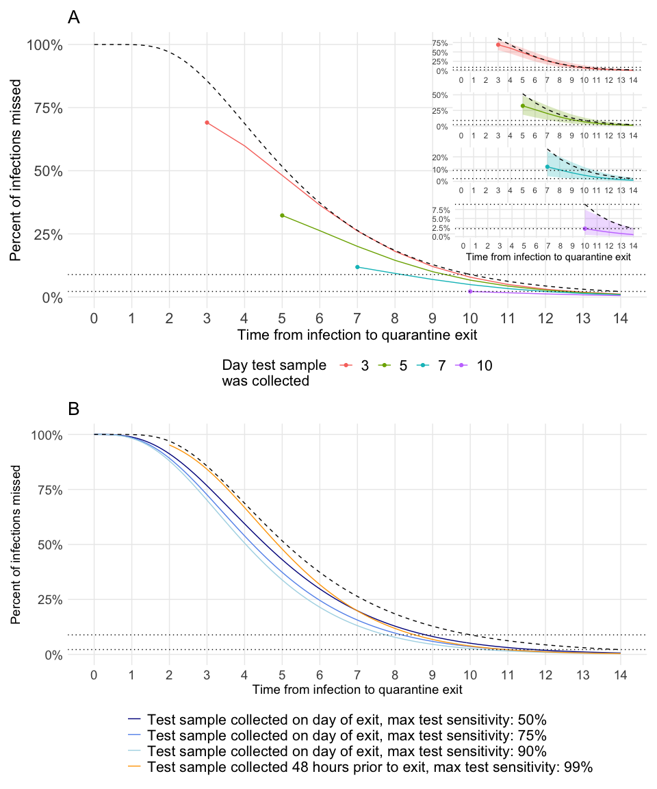

<!-- README.md is generated from README.Rmd. Please edit that file -->

# covidsens

<!-- badges: start -->

<!-- badges: end -->

The goal of covidsens is to calculate the test sensitivity and
probability of missing a COVID-19 infection on a given day
post-exposure.

## Installation

<!-- You can install the released version of covidsens from [CRAN](https://CRAN.R-project.org) with: -->

<!-- ``` r -->

<!-- install.packages("covidsens") -->

<!-- ``` -->

You can install the development version of covidsens from GitHub with:

``` r
# install.packages("devtools")
devtools::install_github("LucyMcGowan/covidsens")
```

## Simple examples

Plot the false negative rate by days since crossing the detection
threshold.

``` r
library(covidsens)
library(ggplot2)

d <- data.frame(
  x = seq(0, 14, by = 0.1),
  fnr = get_fnr(seq(0, 14, by = 0.1))
)

ggplot(d, aes(x, fnr)) +
  geom_line() +
  geom_vline(xintercept = 0, lty = 2) +
  theme_minimal() +
  scale_x_continuous("Days since crossing the threshold", breaks = 0:14) +
  labs(x = "Days since crossing the dection threshold",
       y = "1 - Sensitivity") 
```


Calculate the probability of missing an infection if a test sample is
collected 48 hours prior to quarantine exit.

``` r
d <- data.frame(
  p = purrr::map_dbl(0:14, get_prob_missed_infection, additional_quarantine_time = 2),
  t = 0:14,
  qt = 2:16,
  p2 = plnorm(0:14, 1.63, 0.5, lower.tail = FALSE))

ggplot(d, aes(x = qt, y = p)) +
  geom_line() +
  geom_line(aes(x = t, y = p2), lty = 2) + 
  scale_x_continuous(breaks = 0:14, limits = c(0, 14)) +
  geom_hline(yintercept = c(0.089, 0.022), lty = 3) +
  theme_minimal() +
  labs(x = "Days from infection to quarantine exit",
       y = "Proportion of infections missed")
```


Calculate the probability of missing an infection on a given test day
with additional quarantine days.

``` r
vals <- expand.grid(
  t = c(0, 3, 5, 7, 10),
  s = seq(0, 14, 0.1)
)
vals$p <- purrr::map2_dbl(vals$t, vals$s, get_prob_missed_infection)
vals$qt <- vals$t + vals$s
test_date <- vals[vals$s == 0, ]

ggplot(vals, aes(x = qt, y = p, color = as.factor(t))) +
  geom_line() +
  geom_line(aes(x = qt, y = plnorm(qt, 1.63, 0.5, FALSE)), color = "black", lty = 2) +
  scale_x_continuous(breaks = 0:14, limits = c(0, 14)) +
  geom_hline(yintercept = c(0.089, 0.022), lty = 3) +
  geom_point(data = test_date, aes(x = t, y = p)) +
  theme_minimal() +
  labs(x = "Days from infection to quarantine exit",
       y = "Proportion of infections missed",
       color = "Day test sample \nwas collected") +
  theme(panel.grid.minor = element_blank(),
        legend.position = "bottom") 
```


## Recreate Figures from Paper

### Optimization

``` r
library(tidyverse)
library(dfoptim)
```

``` r
estimate_shenzhen <- function(k, t, shape_y, shape_a, rate_a, rate) {
  dgamma(k, shape_y, rate) * 
    get_fnr(time = k + t, shape = shape_a, rate = rate_a)
}

diff_shenzhen <- function(t, shape_a, rate_a, shape_y, rate) {
  integrate(estimate_shenzhen, 0, Inf, t = t, shape_a = shape_a,
            rate_a = rate_a, shape_y = shape_y, rate = rate)$value - 
    get_shenzhen_estimate(t) 
}

er <- function(x, shape, rate) {
  shape_a <- x[1]
  rate_a <- x[2]
  shape_y <- x[3]
  shape_x <- x[4]
  sum(map_dbl(seq(-8, 7, 1), diff_shenzhen, shape_a = shape_a, 
              rate_a = rate_a, shape_y = shape_y, rate = rate)^2) +
    ((shape_y + shape_x) - shape)^2
}

run_optimization <- function() {
  fit_incubation <- fitdistrplus::fitdist(
    rlnorm(10000, rnorm(1, 1.63, 0.06122), rnorm(1, 0.5, 0.0255102)), "gamma")
  
  o <- nmkb(c(2.3, 0.2, 0.5, 0.5), er,
            lower = c(1, 0.1, 0.1, 0.1), 
            rate = fit_incubation$estimate[2], 
            shape = fit_incubation$estimate[1]) 
  
  data.frame(
    shape_a = o$par[1],
    rate_a = o$par[2],
    shape_y = o$par[3],
    shape_x = o$par[4],
    shape_sym = fit_incubation$estimate[1],
    rate_sym = fit_incubation$estimate[2],
    error = o$value[1]
  )
}
```

``` r
run_optimization <- possibly(run_optimization,
                             otherwise = data.frame(
                               shape_a = NA,
                               rate_a = NA,
                               shape_y = NA,
                               shape_x = NA,
                               shape_sym = NA,
                               rate_sym = NA,
                               error = NA
                             ))
```

``` r
sims <- 5000

set.seed(1)
out <- map_df(1:sims, ~run_optimization())
```

``` r
out %>%
  summarise(shape_a_mean = mean(shape_a),
            shape_a_sd = sd(shape_a),
            rate_a_mean = mean(rate_a),
            rate_a_sd = sd(rate_a),
            shape_y_mean = mean(shape_y),
            shape_y_sd = sd(shape_y),
            shape_x_mean = mean(shape_x),
            shape_x_sd = sd(shape_x),
            rate_mean = mean(rate_sym),
            rate_sd = sd(rate_sym),
            sym_mean = mean(shape_sym),
            .groups = "drop") -> out_sum
knitr::kable(out_sum)
```

| shape\_a\_mean | shape\_a\_sd | rate\_a\_mean | rate\_a\_sd | shape\_y\_mean | shape\_y\_sd | shape\_x\_mean | shape\_x\_sd | rate\_mean |  rate\_sd | sym\_mean |
| -------------: | -----------: | ------------: | ----------: | -------------: | -----------: | -------------: | -----------: | ---------: | --------: | --------: |
|       2.250097 |    0.3992711 |     0.2137284 |   0.0389069 |       2.091456 |    0.7466036 |       2.093612 |    0.4981271 |  0.7269191 | 0.0939308 |  4.189122 |

### Figure 1

``` r
incubation <- tibble(
  x = rep(seq(0, 14, by = 0.1), sims),
  y = dlnorm(x, rnorm(sims, 1.63, 0.06122), rnorm(sims, 0.50, 0.0255102))
) %>%
  group_by(x) %>%
  summarise(m = median(y),
            lcl = quantile(y, 0.025),
            ucl = quantile(y, 0.975),
            .groups = "drop")
incubation_plot <- incubation %>%
  ggplot(aes(x, m)) +
  geom_line(color = "orange") +
  geom_ribbon(aes(ymin = lcl, ymax = ucl), color = NA, alpha = 0.25, fill = "orange") +
  labs(x = "Time from infection to symptom onset",
       y = "Density") + 
  theme_minimal() +
  theme(panel.grid = element_blank(),
        axis.line = element_line(),
        axis.ticks = element_line())
```

``` r
shenzhen_sensitivity <- tibble(
  x = rep(seq(-8, 7, by = 0.1), sims),
  y = map_dbl(x, get_shenzhen_estimate)
) %>%
  group_by(x) %>%
  summarise(m = 1 - median(y),
            lcl = 1 - quantile(y, 0.025),
            ucl = 1 - quantile(y, 0.975),
            .groups = "drop")
shenzhen_sensitivity_p <- 
  shenzhen_sensitivity %>%
  ggplot(aes(x, m)) +
  geom_line(color = "orange") +
  geom_ribbon(aes(ymin = lcl, ymax = ucl), color = NA, alpha = 0.25, fill = "orange") +
  labs(x = "Time from symptom onset",
       y = "Sensitivity") + 
  theme_minimal() +
  theme(panel.grid = element_blank(),
        axis.line = element_line(),
        axis.ticks = element_line())
```

``` r
exposure_to_threshold <- tibble(
  x = rep(seq(0, 14, 0.1), sims),
  y = dgamma(x, shape = out$shape_x, rate = out$rate_sym)
) %>%
  group_by(x) %>%
  summarise(m = median(y),
            lcl = quantile(y, 0.025),
            ucl = quantile(y, 0.975),
            .groups = "drop") %>%
  ggplot(aes(x, m)) +
  geom_line(color = "cornflower blue") +
  geom_ribbon(aes(ymin = lcl, ymax = ucl), alpha = 0.25, color = NA, fill = "cornflower blue") +
  coord_cartesian(ylim = c(0, 1)) +
  labs(x = "Infection to threshold",
       y = "Density") +
  theme_minimal() +
  theme(panel.grid = element_blank(),
        axis.line = element_line(),
        axis.ticks = element_line())
```

``` r
threshold_to_symtpoms <- tibble(
  x = rep(seq(0, 14, 0.1), sims),
  y = dgamma(x, shape = out$shape_y, rate = out$rate_sym)
) %>%
  group_by(x) %>%
  summarise(m = median(y),
            lcl = quantile(y, 0.025),
            ucl = quantile(y, 0.975),
            .groups = "drop") %>%
  ggplot(aes(x, m)) +
  geom_line(color = "cornflower blue") +
  geom_ribbon(aes(ymin = lcl, ymax = ucl), alpha = 0.25, color = NA, fill = "cornflower blue") +
  coord_cartesian(ylim = c(0, 1)) +
  labs(x = "Threshold to symptom onset",
       y = "Density") +
  theme_minimal() +
  theme(panel.grid = element_blank(),
        axis.line = element_line(),
        axis.ticks = element_line())
```

``` r
get_sensitivity_sym <- function(t, shape_a, rate_a, shape_y, rate) {
  integrate(estimate_shenzhen, 0, Inf, t = t, shape_a = shape_a,
            rate_a = rate_a, shape_y = shape_y, rate = rate)$value
}

params <- tibble(
  shape_a = out$shape_a,
  rate_a = out$rate_a,
  shape_y = out$shape_y,
  rate = out$rate_sym
)
params <- expand_grid(
  t = seq(-8, 7, 0.1),
  params
)
sensitivity <- params %>%
  mutate(sens = pmap_dbl(params, get_sensitivity_sym))
```

``` r
params <- tibble(
  shape = out$shape_a,
  rate = out$rate_a
)

params <- expand_grid(
  t = seq(0, 14, 0.1),
  params
)
sens <- params %>%
  mutate(y = pmap_dbl(params, get_sensitivity)) %>%
  group_by(t) %>%
  summarise(m = median(y),
            lcl = quantile(y, 0.025),
            ucl = quantile(y, 0.975),
            .groups = "drop")
```

``` r
sensitivity_summ <- sensitivity %>%
  group_by(t) %>%
  summarise(m = 1 - median(sens),
            lcl = 1 - quantile(sens, 0.025),
            ucl = 1 - quantile(sens, 0.975),
            .groups = "drop")
inferred_sensitivity <- sens %>%
  ggplot(aes(t, m)) +
  geom_line(color = "cornflower blue") +
  geom_ribbon(aes(ymin = lcl, ymax = ucl), alpha = 0.25, color = NA, fill = "cornflower blue") +
  labs(x = "Time from threshold",
       y = "Sensitivity") +
  theme_minimal() +
  theme(panel.grid = element_blank(),
        axis.line = element_line(),
        axis.ticks = element_line())
```

``` r
incubation_inferred <- tibble(
  t = rep(seq(0, 14, 0.1), sims),
  y = dgamma(t, shape = out$shape_x + out$shape_y, rate = out$rate_sym),
) %>% 
  group_by(t) %>%
  summarise(m = median(y),
            lcl = quantile(y, 0.025),
            ucl = quantile(y, 0.975),
            .groups = "drop")
```

``` r
library(patchwork)
incubation_plot <- incubation_plot +
  geom_line(data = incubation_inferred, aes(t, m), color = "cornflower blue", lty = 2) 

shenzhen_sensitivity_p <- shenzhen_sensitivity_p +
  geom_line(data = sensitivity_summ, aes(t, m), color = "cornflower blue", lty = 2)

(incubation_plot | shenzhen_sensitivity_p) / (exposure_to_threshold | threshold_to_symtpoms |  inferred_sensitivity) + 
  plot_annotation(tag_levels = 'A')
```


### Figure 2

``` r
sims <- nrow(out)
set.seed(1)

params <- tibble(
  id = 1:sims,
  shape_fnr = out$shape_a,
  rate_fnr = out$rate_a,
  shape_exposure_to_threshold = out$shape_x,
  shape_threshold_to_symptoms = out$shape_y,
  rate = out$rate_sym
)
vals <- expand_grid(
  test_time = c(3, 5, 7, 10),
  additional_quarantine_time = 0:14,
  id = 1:sims
) %>%
  filter(test_time + additional_quarantine_time <= 14) %>%
  left_join(params, by = "id") %>%
  select(-id)

d <- vals %>%
  mutate(p = pmap_dbl(vals, possibly(get_prob_missed_infection, otherwise = NA)),
         qt = test_time + additional_quarantine_time) 
```

``` r
d %>%
  group_by(test_time, additional_quarantine_time, qt) %>%
  summarise(m_p = median(p, na.rm = TRUE),
            mean_p = mean(p, na.rm = TRUE),
            lcl_p = quantile(p, 0.025, na.rm = TRUE),
            ucl_p = quantile(p, 0.975, na.rm = TRUE),
            .groups = "drop") -> d_summ
```

``` r
d_summ %>%
  filter(additional_quarantine_time == 0) -> d_test_time
f2 <- d_summ %>%
  ggplot(aes(x = qt, y = m_p, color = as.factor(test_time))) +
  geom_line() +
  geom_point(data = d_test_time) +
  geom_line(data = 
              data.frame(x = seq(0, 14, 0.1), 
                         y = plnorm(seq(0, 14, 0.1), 1.63, 0.5, lower.tail = FALSE)),
            aes(x = x, y = y), color = "black", lty = 2) +
  scale_x_continuous(breaks = 0:14, limits = c(0, 14)) +
  scale_y_continuous(labels = scales::percent) +
  geom_hline(yintercept = c(0.089, 0.022), lty = 3) +
  theme_minimal() +
  labs(x = "Time from infection to quarantine exit",
       y = "Percent of infections missed",
       color = "Day test sample \nwas collected",
       fill = "Day test sample \nwas collected",
       title = "A") +
  theme(panel.grid.minor = element_blank(),
        legend.position = "bottom",
        axis.text = element_text(size = 16),
        axis.title = element_text(size = 16),
        plot.title = element_text(size = 20),
        legend.title = element_text(size = 16),
        legend.text = element_text(size = 16))
```

``` r
f2_3 <- d_summ %>%
  filter(test_time == 3) %>%
  ggplot(aes(x = qt, y = m_p, color = as.factor(test_time))) +
  geom_line() +
  geom_point(data = d_test_time %>% filter(test_time == 3)) +
  geom_ribbon(aes(ymin = lcl_p, ymax = ucl_p, fill = as.factor(test_time)), alpha = 0.25, color = NA) +
  geom_line(data = data.frame(x = 3:14, y = plnorm(3:14, 1.63, 0.5, lower.tail = FALSE)), 
            aes(x = x, y = y), color = "black", lty = 2) +
  scale_x_continuous(breaks = 0:14, limits = c(0, 14)) +
  scale_y_continuous(labels = scales::percent) +
  geom_hline(yintercept = c(0.089, 0.022), lty = 3) +
  theme_minimal() +
  labs(x = "",
       y = "") +
  theme(panel.grid.minor = element_blank(),
        legend.position = "none",
        panel.background = element_rect(fill = "white", color = "white"))
```

``` r
f2_5 <- d_summ %>%
  filter(test_time == 5) %>%
  ggplot(aes(x = qt, y = m_p, color = as.factor(test_time))) +
  geom_line(color = "#7CAE00") +
  geom_point(data = d_test_time %>% filter(test_time == 5), color = "#7CAE00") +
  geom_ribbon(aes(ymin = lcl_p, ymax = ucl_p, fill = as.factor(test_time)), fill = "#7CAE00", alpha = 0.25, color = NA) +
  geom_line(data = data.frame(x = 5:14, y = plnorm(5:14, 1.63, 0.5, lower.tail = FALSE)), 
            aes(x = x, y = y), color = "black", lty = 2) +
  scale_x_continuous(breaks = 0:14, limits = c(0, 14)) +
  scale_y_continuous(labels = scales::percent, breaks = c(0, 0.25, 0.5)) +
  geom_hline(yintercept = c(0.089, 0.022), lty = 3) +
  theme_minimal() +
  labs(x = "",
       y = "") +
  theme(panel.grid.minor = element_blank(),
        legend.position = "bottom",
        panel.background = element_rect(fill = "white", color = "white"))
```

``` r
f2_7 <- d_summ %>%
  filter(test_time == 7) %>%
  ggplot(aes(x = qt, y = m_p, color = as.factor(test_time))) +
  geom_line(color = "#00BFC4") +
  geom_point(data = d_test_time %>% filter(test_time == 7), color = "#00BFC4") +
  geom_ribbon(aes(ymin = lcl_p, ymax = ucl_p, fill = as.factor(test_time)), fill = "#00BFC4", alpha = 0.25, color = NA) +
  geom_line(data = data.frame(x = 7:14, y = plnorm(7:14, 1.63, 0.5, lower.tail = FALSE)), 
            aes(x = x, y = y), color = "black", lty = 2) +  
  scale_x_continuous(breaks = 0:14, limits = c(0, 14)) +
  scale_y_continuous(labels = scales::percent) +
  geom_hline(yintercept = c(0.089, 0.022), lty = 3) +
  theme_minimal() +
  labs(x = "",
       y = "") +
  theme(panel.grid.minor = element_blank(),
        legend.position = "bottom",
        panel.background = element_rect(fill = "white", color = "white"))
```

``` r
f2_10 <- d_summ %>%
  filter(test_time == 10) %>%
  ggplot(aes(x = qt, y = m_p, color = as.factor(test_time))) +
  geom_line(color = "#C77CFF") +
  geom_point(data = d_test_time %>% filter(test_time == 10), color = "#C77CFF") +
  geom_ribbon(aes(ymin = lcl_p, ymax = ucl_p, fill = as.factor(test_time)), fill = "#C77CFF", alpha = 0.25, color = NA) +
  geom_line(data = data.frame(x = 10:14, y = plnorm(10:14, 1.63, 0.5, lower.tail = FALSE)), 
            aes(x = x, y = y), color = "black", lty = 2) +  
  scale_x_continuous(breaks = 0:14, limits = c(0, 14)) +
  scale_y_continuous(labels = scales::percent) +
  geom_hline(yintercept = c(0.089, 0.022), lty = 3) +
  theme_minimal() +
  labs(x = "Time from infection to quarantine exit",
       y = "") +
  theme(panel.grid.minor = element_blank(),
        legend.position = "bottom",
        panel.background = element_rect(fill = "white", color = "white"))
```

``` r
vals <- expand_grid(
  shape_fnr = out_sum$shape_a_mean,
  rate_fnr = out_sum$rate_a_mean,
  shape_threshold_to_symptoms = out_sum$shape_y_mean,
  shape_exposure_to_threshold = out_sum$shape_x_mean,
  rate = out_sum$rate_mean,
  test_time = seq(0, 14, by = 0.1),
  additional_quarantine_time = c(0, 2),
  max_sensitivity = c(0.99, 0.90, 0.75, 0.5),
)

compare_sens <- vals %>%
  mutate(p = pmap_dbl(vals, possibly(get_prob_missed_infection, otherwise = NA)),
         qt = test_time + additional_quarantine_time) 
```

``` r
compare_sens %>%
  group_by(test_time, additional_quarantine_time, qt, max_sensitivity) %>%
  summarise(m_p = median(p, na.rm = TRUE),
            mean = mean(p, na.rm = TRUE),
            lcl = quantile(p, 0.025, na.rm = TRUE),
            ucl = quantile(p, 0.975, na.rm = TRUE),
            .groups = "drop") -> compare_sens_summ
compare_sens_summ %>%
  filter(additional_quarantine_time %in% c(0, 2))
#> # A tibble: 1,128 x 8
#>    test_time additional_quarantin…    qt max_sensitivity   m_p  mean   lcl   ucl
#>        <dbl>                 <dbl> <dbl>           <dbl> <dbl> <dbl> <dbl> <dbl>
#>  1       0                       0   0              0.5  1.00  1.00  1.00  1.00 
#>  2       0                       0   0              0.75 1.00  1.00  1.00  1.00 
#>  3       0                       0   0              0.9  1.00  1.00  1.00  1.00 
#>  4       0                       0   0              0.99 1.00  1.00  1.00  1.00 
#>  5       0                       2   2              0.5  0.952 0.952 0.952 0.952
#>  6       0                       2   2              0.75 0.952 0.952 0.952 0.952
#>  7       0                       2   2              0.9  0.952 0.952 0.952 0.952
#>  8       0                       2   2              0.99 0.952 0.952 0.952 0.952
#>  9       0.1                     0   0.1            0.5  1.00  1.00  1.00  1.00 
#> 10       0.1                     0   0.1            0.75 1.00  1.00  1.00  1.00 
#> # … with 1,118 more rows
```

``` r
f3 <- compare_sens_summ %>%
  filter((additional_quarantine_time == 2 & max_sensitivity == 0.99) | (additional_quarantine_time == 0 & max_sensitivity %in% c(0.5, 0.75, 0.90))) %>%
  ggplot(aes(x = qt, y = m_p)) +
  geom_line(aes(color = as.factor(max_sensitivity))) +
  geom_line(
    data = 
      data.frame(x = seq(0, 14, 0.1),
                 y = plnorm(seq(0, 14, 0.1), 1.63, 0.5, lower.tail = FALSE)),
    aes(x = x, y = y), color = "black", lty = 2) +
  scale_x_continuous(breaks = 0:14, limits = c(0, 14)) +
  scale_y_continuous(labels = scales::percent) +
  geom_hline(yintercept = c(0.089, 0.022), lty = 3) +
  theme_minimal() +
  scale_color_manual("", values = c("dark blue", "cornflower blue", "light blue", "orange"),
                     labels = c(
                       "Test sample collected on day of exit, max test sensitivity: 50%",
                       "Test sample collected on day of exit, max test sensitivity: 75%",
                       "Test sample collected on day of exit, max test sensitivity: 90%",
                       "Test sample collected 48 hours prior to exit, max test sensitivity: 99%")) +
  labs(x = "Time from infection to quarantine exit",
       y = "Percent of infections missed",
       title = "B") +
  theme(panel.grid.minor = element_blank(),
        legend.position = "bottom",
        axis.text = element_text(size = 14),
        axis.title = element_text(size = 14),
        plot.title = element_text(size = 20),
        legend.text = element_text(size = 16)) +
  guides(colour = guide_legend(nrow = 4))
```

``` r
(f2 + inset_element(f2_3, left = 0.6, bottom = 0.75, right = 1, top = 1) +
   inset_element(f2_5, left = 0.6, bottom = 0.55, right = 1, top = 0.8) +
   inset_element(f2_7, left = 0.6, bottom = 0.35, right = 1, top = 0.6) +
   inset_element(f2_10, left = 0.6, bottom = 0.15, right = 1, top = 0.4)) / 
  f3 + plot_layout(heights = c(2, 1.75))
```



``` r
ggsave("man/figures/fig2.pdf", height = 12, width = 10)
#> Warning: Removed 20 row(s) containing missing values (geom_path).
ggsave("man/figures/fig2.png", height = 12, width = 10)
#> Warning: Removed 20 row(s) containing missing values (geom_path).
```
