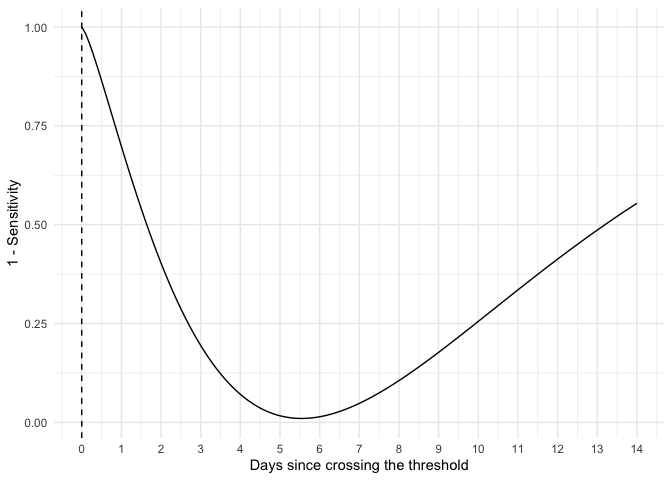
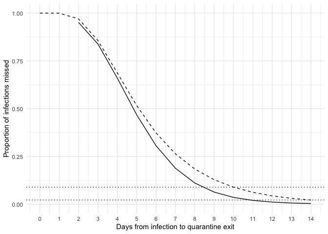

<!-- README.md is generated from README.Rmd. Please edit that file -->

# covidsens

<!-- badges: start -->

<!-- badges: end -->

The goal of covidsens is to calculate the test sensitivity and
probability of missing a COVID-19 infection on a given day
post-exposure.

## Installation

<!-- You can install the released version of covidsens from [CRAN](https://CRAN.R-project.org) with: -->

<!-- ``` r -->

<!-- install.packages("covidsens") -->

<!-- ``` -->

You can install the development version of covidsens from GitHub with:

``` r
# install.packages("devtools")
devtools::install_github("LucyMcGowan/covidsens")
```

## Example

Plot the false negative rate by days since crossing the detection
threshold.

``` r
library(covidsens)
library(ggplot2)

d <- data.frame(
  x = seq(0, 14, by = 0.1),
  fnr = get_fnr(seq(0, 14, by = 0.1))
)

ggplot(d, aes(x, fnr)) +
  geom_line() +
  geom_vline(xintercept = 0, lty = 2) +
  theme_minimal() +
  scale_x_continuous("Days since crossing the threshold", breaks = 0:14) +
  labs(x = "Days since crossing the dection threshold",
       y = "1 - Sensitivity") 
```



Calculate the probability of missing an infection if a test sample is
collected 48 hours prior to quarantine exit.

``` r
d <- data.frame(
  p = purrr::map_dbl(0:14, get_prob_missed_infection, additional_quarantine_time = 2),
  t = 0:14,
  qt = 2:16,
  p2 = plnorm(0:14, 1.63, 0.5, lower.tail = FALSE))

ggplot(d, aes(x = qt, y = p)) +
  geom_line() +
  geom_line(aes(x = t, y = p2), lty = 2) + 
  scale_x_continuous(breaks = 0:14, limits = c(0, 14)) +
  geom_hline(yintercept = c(0.089, 0.022), lty = 3) +
  theme_minimal() +
  labs(x = "Days from exposure to quarantine exit",
       y = "Proportion of infections missed")
```



Calculate the probability of missing an infection on a given test day
with additional quarantine days.

``` r
vals <- expand.grid(
  t = c(0, 3, 5, 7, 10),
  s = seq(0, 14, 0.1)
)
vals$p <- purrr::map2_dbl(vals$t, vals$s, get_prob_missed_infection)
vals$qt <- vals$t + vals$s
test_date <- vals[vals$s == 0, ]

ggplot(vals, aes(x = qt, y = p, color = as.factor(t))) +
  geom_line() +
  geom_line(aes(x = qt, y = plnorm(qt, 1.63, 0.5, FALSE)), color = "black", lty = 2) +
  scale_x_continuous(breaks = 0:14, limits = c(0, 14)) +
  geom_hline(yintercept = c(0.089, 0.022), lty = 3) +
  geom_point(data = test_date, aes(x = t, y = p)) +
  theme_minimal() +
  labs(x = "Days from exposure to quarantine exit",
       y = "Proportion of infections missed",
       color = "Day test sample \nwas collected") +
  theme(panel.grid.minor = element_blank(),
        legend.position = "bottom") 
```


